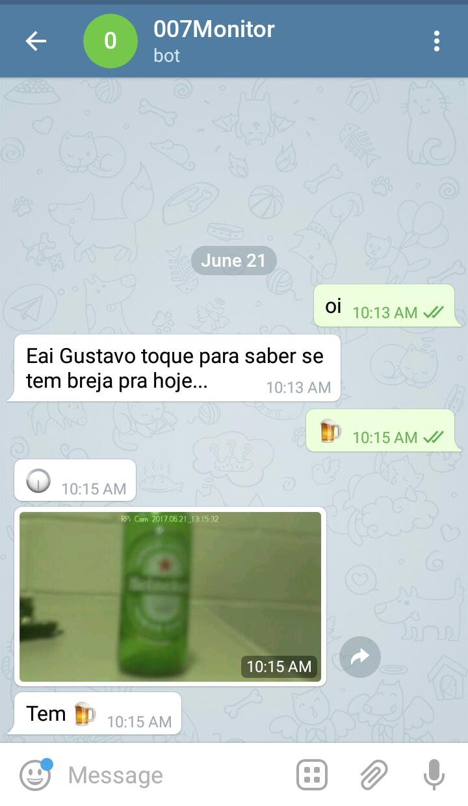

# :beer: 007Monitor :beer: :rocket: :rocket:

"*No mundo atual, as pessoas têm muitas
preocupações: trabalho, faculdade, família, contas etc.
Um dos poucos momentos para relaxar na semana é
aquele encontro para tomar uma cerveja com os amigos,
dar risada e falar sobre assuntos aleatórios. Entretanto,
com o decorrer da noite, muitas vezes ninguém acaba
percebendo que aquela era a última cerveja da geladeira.*"

"*A idéia do 007Monitor é que as pessoas tenham uma
coisa a menos para se preocupar durante aquele momento
de distração com os amigos, mantendo o usuário
informado sobre a situação atual da geladeira diretamente
no seu celular.*"

## Demo
### Em ação :sunglasses:
<div style="text-align:center"></div>

## Configuração e implementação

### Requisítos.
* Geladeira;
* Cerveja :beer:;
* Interface para capturar imagem :robo:;

  Neste case foi usado um Raspberry PI 3 e uma micro camera para capturar as imagens com esta [interface web](https://github.com/silvanmelchior/RPi_Cam_Web_Interface).
* [Api para reconhecimento de padrões](https://github.com/gusanthiago/Api-recognition-image)

  Para ser possível tornar este sonho realidade foi necessário desenvolver uma api para classificar e demarcar as características de uma imagem.

* Geladeira com cerveja. :scream:

### Configuração.

#### Instalando as dependências

```
> bundle install
```

#### Setando variáveis de ambiente.

* token - Fornecida pelo [BotFather](https://telegram.me/BotFather) é a autenticação que o Telegram precisa para autenticar seu script no bot.

* url_cam - Url de acesso a imagem do Raspberry.

* url_api - Url da api para acessar as informações necessárias.
